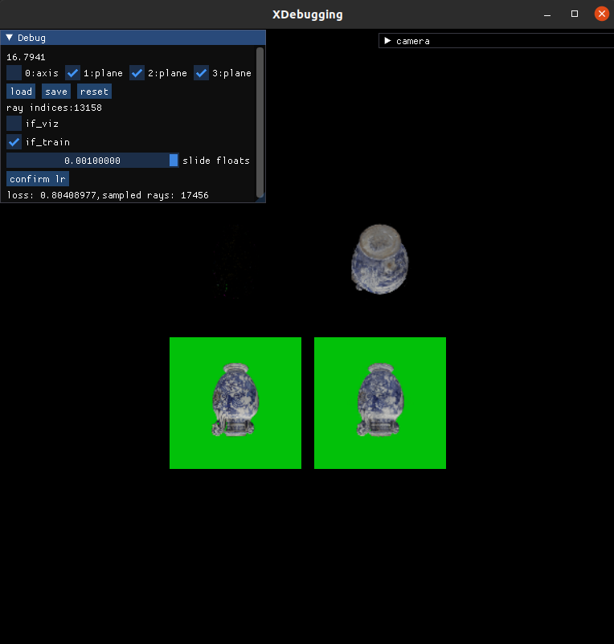

# H3D Triplane

This is an nerf implentation using Triplane with a debug view that can visualize the sample points along the rays.



## 1. Render Dataset From GLB

Place **YOUR** glb model into ```data/3d/example.glb```, it will render the the 3d glb model into ```data/2d/example```, detail in [here](rendering/README.md).

```
cd rendering
sh render.sh example
```


## 2. Train
The hyper paramters are located in the top lines of main.py.
```
python main.py
```

## Reference
[Tri-MipRF](https://wbhu.github.io/projects/Tri-MipRF/)